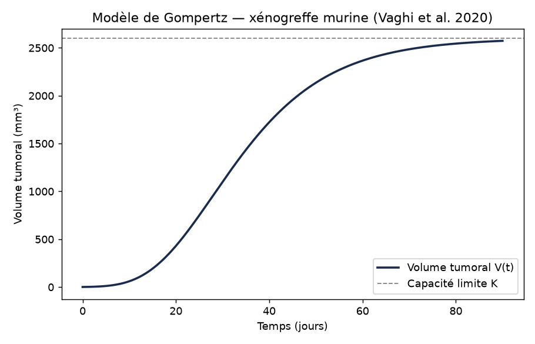
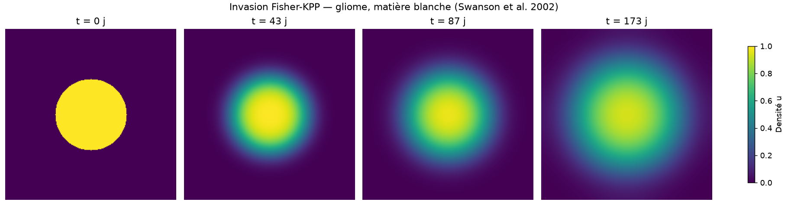
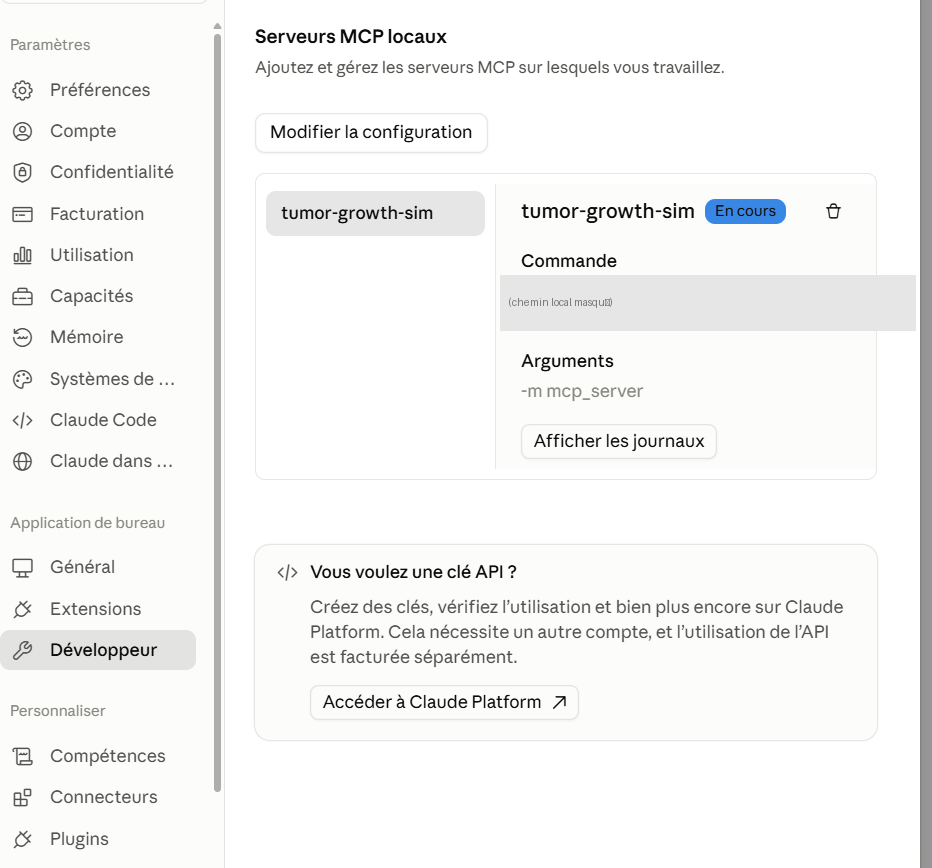
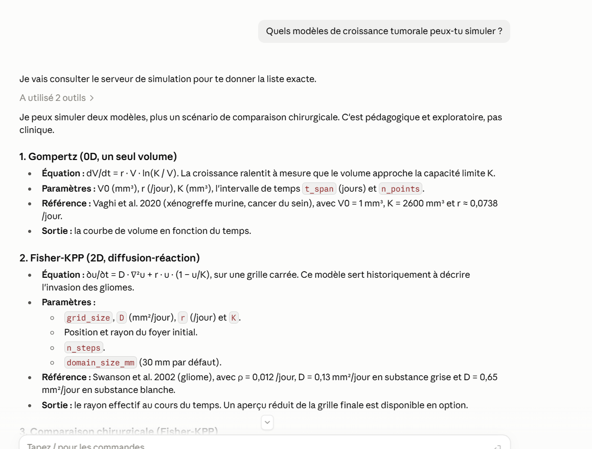
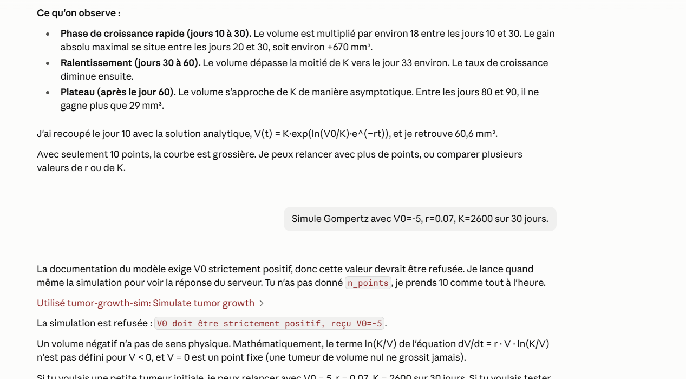
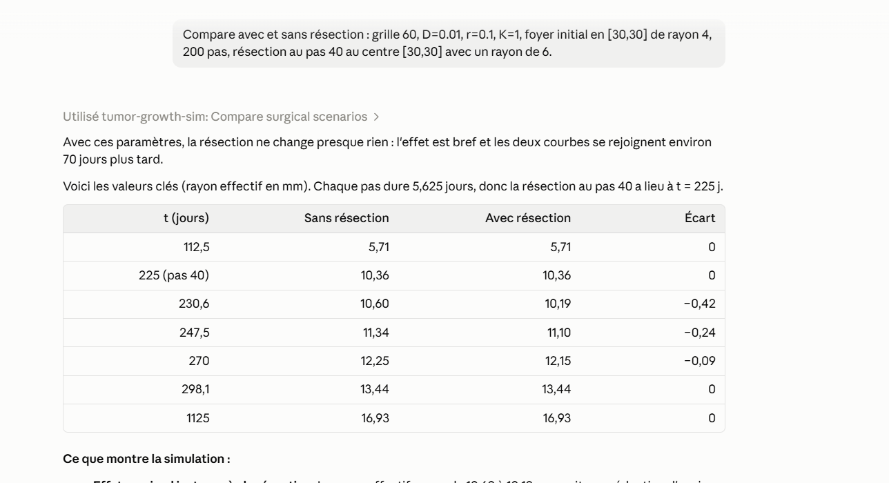

# Simulation de croissance tumorale

Outil de simulation numérique de croissance tumorale, à visée d'oncologie
computationnelle / jumeaux numériques. Le projet implémente plusieurs
modèles mathématiques classiques de croissance et d'invasion tumorale,
avec une architecture pensée pour en ajouter facilement de nouveaux.

## Objectif

Fournir une base de simulation claire, testée et documentée, réutilisable
pour explorer différents modèles de croissance tumorale et comparer leur
comportement — et illustrer le schéma « jumeau numérique » : modèle
mécaniste, calibration sur données observées (moindres carrés), et
comparaison avec un surrogate model par apprentissage (PyTorch). Les
simulations sont aussi exposées comme outils appelables par un agent IA via
un serveur MCP.

## Structure du dépôt

```
src/
├── simulation/          # Modèles de simulation
│   ├── base.py                # Interface commune TumorGrowthModel
│   ├── gompertz.py             # Modèle de croissance de Gompertz (0D)
│   ├── diffusion_reaction.py  # Modèle de diffusion-réaction Fisher-KPP (2D)
│   ├── calibration.py         # Calibration par moindres carrés (scipy)
│   └── surrogate.py           # Surrogate models par apprentissage (PyTorch)
└── mcp_server/          # Serveur MCP (outils appelables par un agent IA)
    ├── tools.py         # Logique des outils, en fonctions Python pures
    └── server.py        # Enregistrement des outils MCP + lancement stdio
tests/                   # Tests unitaires (pytest)
notebooks/               # Notebooks d'exploration
scripts/
├── generate_notebook.py  # Génère notebooks/01_exploration.ipynb (voir plus bas)
└── execute_notebook.py   # Exécute le notebook et y enregistre les graphiques
```

## Modèles implémentés

### Gompertz (`src/simulation/gompertz.py`)

Modèle 0D de croissance tumorale à volume unique :

```
dV/dt = r * V * ln(K / V)
```

où `V` est le volume tumoral, `r` le taux de croissance intrinsèque et `K`
la capacité limite (volume maximal asymptotique). La croissance ralentit
progressivement à mesure que `V` approche de `K`. Résolu numériquement via
`scipy.integrate.solve_ivp`.



### Diffusion-réaction Fisher-KPP (`src/simulation/diffusion_reaction.py`)

Modèle 2D d'invasion tumorale sur une grille spatiale :

```
∂u/∂t = D * ∇²u + r * u * (1 - u/K)
```

où `u(x, y, t)` est une densité de cellules tumorales, `D` le coefficient
de diffusion (migration cellulaire), `r` le taux de prolifération et `K`
la densité maximale locale. Résolu par différences finies explicites
(numpy pur), avec conditions aux limites de Neumann (flux nul).



### Calibration (`src/simulation/calibration.py`)

Illustre le schéma « modèle mécaniste + calibration sur données observées »,
pour les deux modèles :

- `generate_noisy_gompertz_observations` / `calibrate_gompertz` : ré-estiment
  `(r, K)` par moindres carrés non linéaires (`scipy.optimize.least_squares`)
  à partir d'un volume tumoral observé bruité.
- `generate_noisy_fisher_kpp_observations` / `calibrate_fisher_kpp` :
  ré-estiment `(D, r)` à partir de la **masse tumorale totale** observée
  bruitée (et non du rayon effectif via seuil, dont le gradient est nul par
  morceaux et bloque l'optimiseur — voir les docstrings du module).

Chaque calibration retourne une estimation de l'incertitude sur les
paramètres. Il s'agit d'une preuve de concept sur données synthétiques, pas
d'une calibration sur données réelles de bioproduction.

### Surrogate models par apprentissage (`src/simulation/surrogate.py`)

Alternative à la calibration classique : un petit réseau de neurones
(PyTorch) apprend directement la relation « courbe observée → paramètres »
à partir de milliers d'exemples synthétiques, puis prédit en une fraction de
milliseconde, sans aucune nouvelle simulation. Comparé objectivement à la
calibration classique (précision **et** temps de calcul) dans le notebook,
sur les deux modèles :

- **Fisher-KPP** : précision comparable, mais des dizaines de milliers de
  fois plus rapide — la calibration classique doit re-simuler la grille 2D à
  chaque itération de l'optimiseur, ce qui coûte cher.
- **Gompertz** : toujours très rapide, mais nettement moins précis que la
  calibration classique, qui converge déjà vite et bien sur cette ODE 0D.

Ce contraste illustre que le surrogate n'est pas systématiquement la
meilleure option : son intérêt dépend du coût de la simulation qu'il
remplace.

## Installation

```powershell
python -m venv .venv
.venv\Scripts\Activate.ps1
pip install --upgrade pip
pip install -r requirements.txt
python -m ipykernel install --user --name tumor-growth-sim --display-name "Python (tumor-growth-sim)"
```

`requirements.txt` installe le projet en mode éditable avec ses dépendances
de développement (`pip install -e .[dev]`) ; les versions ne sont déclarées
qu'une seule fois, dans `pyproject.toml`.

## Utilisation rapide

```python
from simulation.gompertz import simulate

t, V = simulate(V0=100, r=0.05, K=150_000, t_span=(0, 720), n_points=300)
```

```python
from simulation.diffusion_reaction import simulate_2d

t, grids = simulate_2d(
    grid_size=100, D=0.005, r=0.05, K=1.0,
    initial_tumor_position=(50, 50), initial_radius=3, n_steps=300,
)
```

Voir `notebooks/01_exploration.ipynb` pour un exemple complet avec
visualisations.

Le contenu du notebook est défini dans `scripts/generate_notebook.py` (pas
édité directement dans le `.ipynb`, pour rester lisible en diff git) : pour
le modifier, éditer ce script puis relancer `python scripts/generate_notebook.py`.
Cette commande régénère le notebook **sans résultats** ; pour y enregistrer les
graphiques (visibles sans relancer le notebook, par exemple sur GitHub), lancer
ensuite `python scripts/execute_notebook.py` (plusieurs minutes, l'entraînement
PyTorch étant la partie la plus longue). L'animation n'est volontairement pas
conservée dans le fichier (plusieurs Mo) : elle s'affiche en exécutant sa cellule.

## Serveur MCP

Expose trois outils à un agent IA (nécessite l'extra `mcp`, installé par
`requirements.txt`) :

- `get_model_info()` : décrit les modèles disponibles et leurs paramètres.
- `simulate_tumor_growth(model, params, ...)` : simule Gompertz ou Fisher-KPP.
  Pour Fisher-KPP, renvoie le rayon effectif au cours du temps (pas la grille
  complète, trop volumineuse), avec un aperçu réduit optionnel de la grille finale.
- `compare_surgical_scenarios(...)` : simule Fisher-KPP avec et sans
  résection chirurgicale idéalisée (densité mise à zéro dans un disque à un
  instant donné). Une résection partielle entraîne un creux puis une
  repousse ; une résection qui enlève toute la densité non nulle élimine la
  tumeur. Attention : un rayon effectif tombé à 0 ne prouve pas
  l'élimination, car une queue de densité très faible dépasse le bord visible
  et peut repousser. Dans l'exemple testé (grille 60, D=0,01, r=0,1), une
  résection de 21 à 32 cellules cache la tumeur puis elle repousse ; il faut
  environ 34 cellules pour l'éliminer. Cette élimination exacte est une
  propriété du schéma numérique (propagation d'une cellule par pas), pas un
  résultat biologique.

Les erreurs de saisie (paramètre manquant, valeur invalide) sont renvoyées
à l'agent avec un message explicite, pour qu'il puisse corriger son appel.

Lancement manuel (transport stdio) :

```powershell
python -m mcp_server
```

Pour le connecter à Claude Desktop, ajouter dans
`%APPDATA%\Claude\claude_desktop_config.json` (adapter le chemin) :

```json
{
  "mcpServers": {
    "tumor-growth-sim": {
      "command": "C:\\chemin\\vers\\le\\projet\\.venv\\Scripts\\python.exe",
      "args": ["-m", "mcp_server"]
    }
  }
}
```



Testé : aller-retour stdio complet avec le client officiel du SDK MCP
(liste des outils, appel réussi, erreur transmise), puis avec **Claude
Desktop** (Windows, version Microsoft Store) : liste des modèles, simulation
Gompertz (valeurs recoupées avec la solution analytique), erreur volontaire
(`V0 < 0`) renvoyée avec un message explicite, comparaison chirurgicale
partielle puis complète. Sur Windows avec la version Microsoft Store, le
fichier de configuration se trouve dans
`%LOCALAPPDATA%\Packages\Claude_*\LocalCache\Roaming\Claude\` ; il faut
quitter complètement l'application (pas seulement fermer la fenêtre) pour
qu'elle relise la configuration.

### Exemples réels depuis Claude Desktop

`get_model_info` : Claude liste les deux modèles et leurs références sans
avoir lu le code source, uniquement via l'outil.



Une entrée invalide (`V0 = -5`) est refusée par le serveur, et le message
d'erreur précis (pas un message générique) arrive jusqu'à l'agent grâce à
`ToolError` :



`compare_surgical_scenarios` : comparaison chiffrée d'une résection
partielle, avec le tableau de résultats renvoyé par l'outil :



## Tests

```powershell
pytest
```

## Avertissement sur les paramètres

Les paramètres des sections 1 et 2 du notebook (simulation directe) sont
tirés de publications scientifiques réelles, citées dans le notebook :

- **Gompertz** : Vaghi C, Rodallec A, Fanciullino R, et al. *Population
  modeling of tumor growth curves and the reduced Gompertz model improve
  prediction of the age of experimental tumors.* PLOS Computational
  Biology, 16(2):e1007178, 2020. (xénogreffe murine, cancer du sein)
- **Fisher-KPP** : Swanson KR, Bridge C, Murray JD, Alvord EC Jr. *Virtual
  and real brain tumors: using mathematical modeling to quantify glioma
  growth and invasion.* Journal of the Neurological Sciences,
  216(1):1-10, 2002. (gliome, matière grise/blanche)

Ce sont des données précliniques (souris) ou issues d'une cohorte
spécifique de patients, pas une calibration sur un cas clinique donné —
à ne pas utiliser tel quel pour une application clinique. Les sections
3 à 5 (calibration, surrogate) utilisent des valeurs simplifiées choisies
pour illustrer la méthode, indépendamment de ces références.

## Roadmap

- Calibration sur données réelles (au-delà de la preuve de concept sur données synthétiques).
- Couplage Gompertz / Fisher-KPP.
- Modèles additionnels (croissance logistique, Von Bertalanffy).
